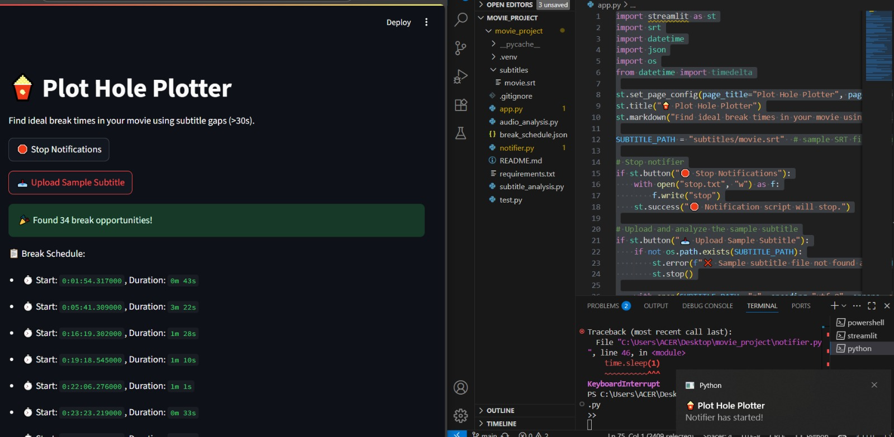

# 🍿 Plot Hole Plotter

Find ideal movie break times using subtitle analysis and receive joke-based notifications.

Team members
Vishnu P Venmany(CUSAT)
Yadhukrishna M(CUSAT)

1. Run `app.py` to generate break schedule.
2. Run `notifier.py` in the background.
3. Get notifications with random jokes when it's time for a break!

The Problem:
Bored of watching movie?But wants to finish it just because started.

The Solution:
Plot Hole Plotter shows the less important scenes of a movie and notifies you to take a break at weak scenes.

TECH USED:
Backend / Processing:
srt – for parsing subtitle (.srt) files
datetime – to calculate time gaps
json – for storing break schedules
io – for file I/O operations

🖥️ Frontend / Interface
Streamlit – to create the interactive web UI

Fun / UX
Random jokes – integrated using Python’s random module and custom joke list

IMPLEMENTATION:
Python 3.10+

RUN
streamlit run  app.py
python notifier.py

Screenshots

Team Contribution
Frontend: Yadhu
Backend: Vishnu

madewith ❤️ at TinkerHub Useless PRojects